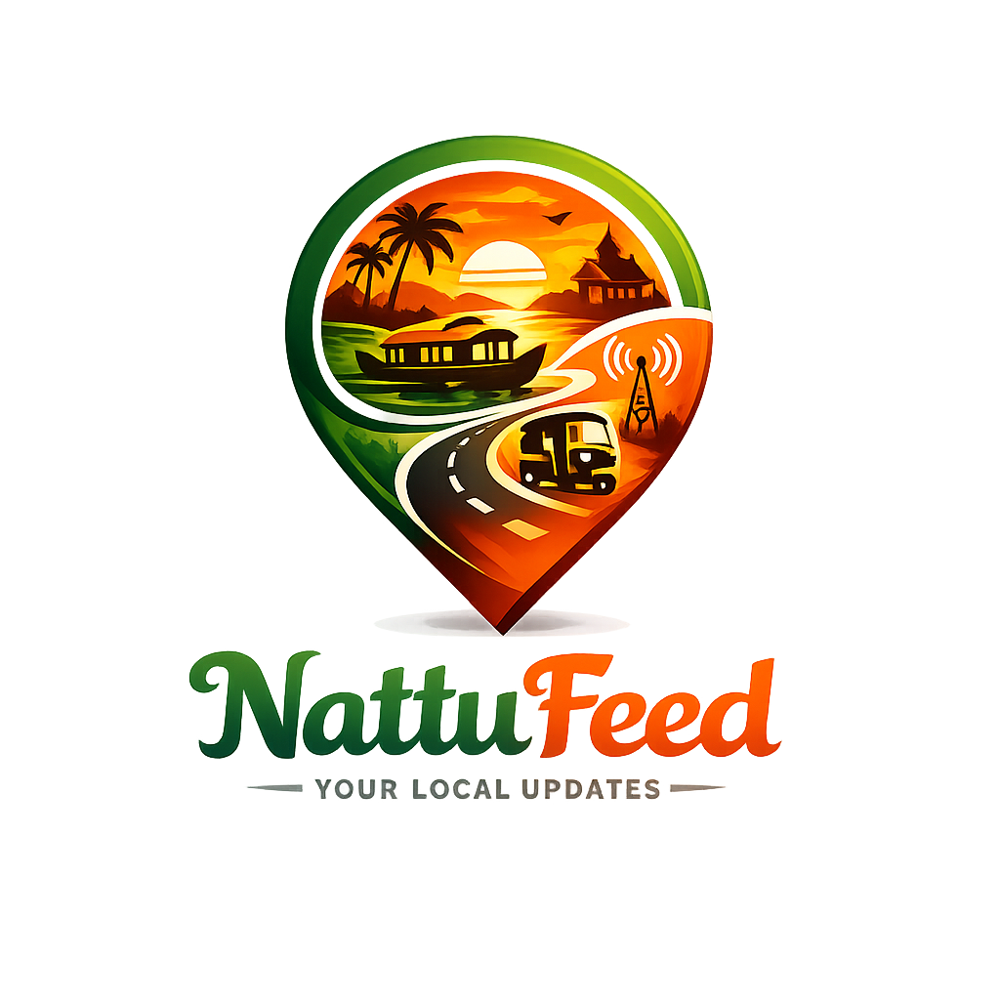

# 🌴 NattuFeed: The Heartbeat of Your Neighborhood

NattuFeed is an **Extreme Premium Hyperlocal Platform** designed for the unique sociotechnical landscape of **Kerala**. It is not just an information repository; it is a community-driven "Local Operating System" that bridges information asymmetry and fosters local cohesion through real-time, trust-verified updates.



## 🎯 The Goal
To empower local wards by transforming passive information into **Community Intelligence**. NattuFeed addresses the "Kerala Model" challenges—from youth exodus and elderly isolation to market price spikes and private transit tracking—all wrapped in a state-of-the-art, glassmorphism-inspired UI.

## 🚀 Key Pillars & Minute Details

### 1. 📍 Precision Hyperlocal Feed
- **Radius-Based Filtering**: Users can calibrate their world-view with **2km, 5km, or 10km** radius toggles using the Haversine formula.
- **Location Intelligence**: Powered by `useLocation` hook with persistent state handling and location-denied fallback primitives.
- **Smart Time Filters**:
  - **🔴 Live**: A real-time pulse of the ward with an animated "Heartbeat" indicator.
  - **✨ Today / 🕰️ Yesterday**: One-tap "Catch-Up" filters to see what happened while you were away.

### 2. 🛡️ The "Me Too" Verification System
- **Trust over Likes**: Traditional "Likes" are replaced by a **Verification System**. Users boost post credibility by confirming updates they personally witness.
- **Community Moderation**: Auto-hide logic triggers for posts with multiple flags, preventing "WhatsApp-style" misinformation noise.
- **Visual Evidence**: Native camera integration for high-resolution event/grievance reporting.

### 3. 🏆 Gamified Karma Ecosystem
- **Leaderboard Podium**: A unified, glassmorphic stage for top neighborhood contributors (Gold, Silver, Bronze) with rank-specific glows and animations.
- **Karma Score**: Points earned for posting helpful updates and verifying others.
- **Smart Rank Pining**: Personalized bottom bar showing exactly how many points you need to reach the Top 10.

### 4. 🌍 Socio-Technical Inclusivity
- **Full Malayalam/English Audit**: 100% translatable interface ensuring accessibility for the 21.8 lakh newly digitally literate users in Kerala.
- **Contextual Categories**:
  - **🚗 Traffic**: Crowdsourced private bus tracking and safety monitoring.
  - **🏪 Market**: Real-time Fish/Rubber/Commodity price transparency.
  - **💡 Utility**: Community-audited public service grievances.
  - **🏥 Health**: Verified blood donation coordination and elderly assistance.

### 5. 📱 PWA & Native Edge
- **iOS/Android Polish**: Native Apple splash screens (40+ resolutions), safe-area utility handling for notches, and a custom guided "Install" flow for Safari.
- **Offline Persistence**: Firestore local caching ensures the feed loads instantly, even in low-connectivity areas (KFON compatible).

## 🛠️ Technology Stack
- **Framework**: [Next.js 15+](https://nextjs.org/) (App Router, Turbopack)
- **Styling**: Vanilla CSS + Glassmorphism-first design system
- **Backend**: [Firebase](https://firebase.google.com/) (Firestore, Auth, Functions, Analytics)
- **Icons**: [Lucide React](https://lucide.dev/)
- **Architecture**: Decoupled fetching/filtering logic for high-performance scale.

## 🚀 Getting Started

```bash
npm install
npm run dev
```

## 📦 Project Structure
- `src/app`: Optimized App Router paths (Leaderboard, Profile, Auth).
- `src/components`: Premium UI primitives (`PostCard`, `QuickSetup`, `EditProfileModal`).
- `src/context`: Language, Auth, and Toast providers.
- `src/lib`: Haversine algorithms and Firebase orchestration.

---
*Built for the people of Kerala. Connecting neighborhoods, one "Me Too" at a time.*
